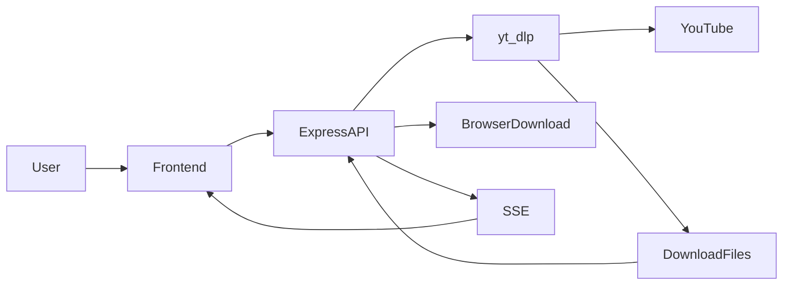
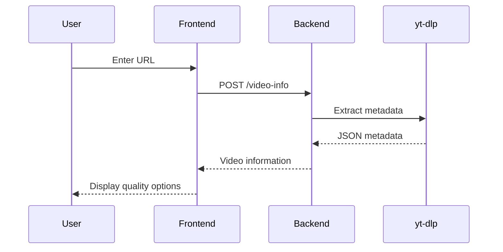
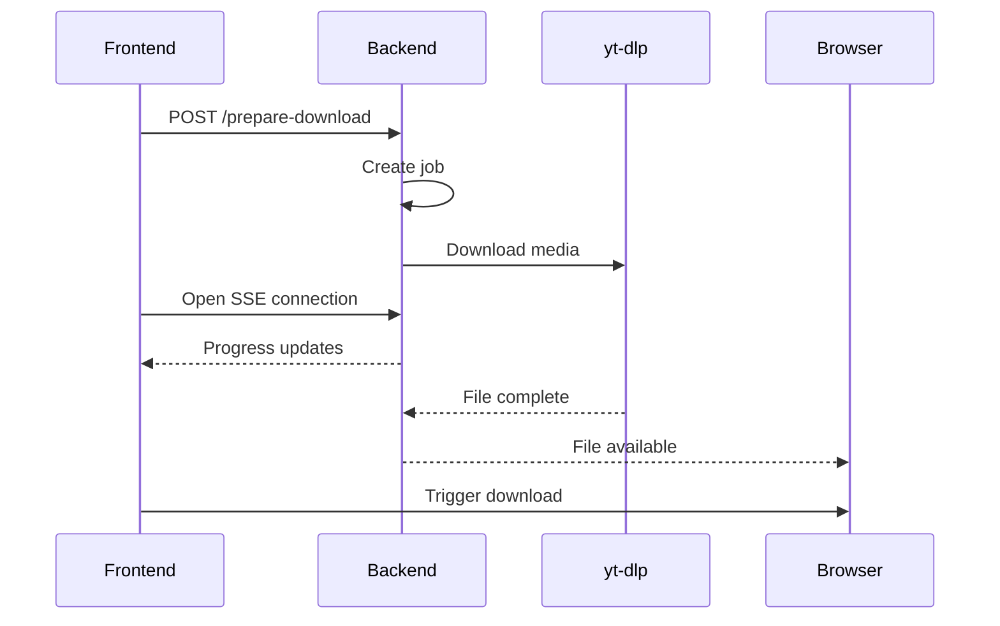

# YouTube Bulk Video Downloader

## Introduction

YouTube Bulk Video Downloader is a web application that allows users to queue multiple YouTube videos, select individual video and audio quality settings, estimate storage requirements, and download media files through a browser-based interface.

The application consists of a frontend for managing download queues and a Node.js backend that uses `yt-dlp` to retrieve video metadata and perform downloads. Downloads are processed asynchronously, while progress updates are delivered to the browser using Server-Sent Events (SSE).

The project solves the problem of downloading multiple YouTube videos with custom quality selections without requiring users to manually execute command-line tools.

## Installation & Setup

> Detailed installation and setup instructions are available in [Setup.md](./Setup.md).

### Prerequisites

The following requirements are needed to run the app:

* Python (12/13 recommended)
* Node.js
* npm
* yt-dlp
* FFmpeg

## Usage

### Start the Server

The backend listens on:

```text
http://localhost:3000
```

## Features

* Add YouTube video URLs and retrieve metadata
* Supports individual videos and playlist-style responses from yt-dlp
* Bulk download queue management
* Per-video quality selection

  * Video resolution and format selection
  * Audio bitrate selection
* Default quality preferences
* Audio-only download mode
* Estimated storage size calculation before download
* Real-time download progress updates using Server-Sent Events (SSE)
* Automatic browser download triggering
* Download job tracking using unique job IDs
* Automatic cleanup of expired download folders
* Protection against path traversal when serving downloaded files
* Static frontend served directly by the backend

## Tech Stack

### Frontend

* HTML5
* CSS
* JavaScript (ES Modules)
* Fetch API
* Server-Sent Events (EventSource)

### Backend

* Node.js
* Express
* CORS middleware

### External Tools

* yt-dlp
* FFmpeg (required by yt-dlp post-processing pipeline)

## Project Structure

```text
project/
├── public/
│   ├── index.html
│   ├── static/
│   │   ├── css/
│   │   │   └── style.css
│   │   ├── js/
│   │   │   ├── main.js
│   │   │   └── utils/
│   │   │       ├── elements.js
│   │   │       └── utils.js
│   │   └── res/
│   │       └── favicon.ico
│
├── downloads/
│   └── <download-id>/
│
├── utils/
│   └── func.js
│
├── server.js
└── .venv/
    └── Scripts/
        └── yt-dlp.exe
```

### Important Files

| File                          | Purpose                                                        |
| ----------------------------- | -------------------------------------------------------------- |
| `server.js`                   | Express application and API endpoints                          |
| `utils/func.js`               | Metadata processing, download orchestration, cleanup utilities |
| `public/index.html`           | Main user interface                                            |
| `static/js/main.js`           | Frontend workflow and API integration                          |
| `static/js/utils/elements.js` | UI rendering and download management                           |
| `static/js/utils/utils.js`    | Shared utility functions                                       |

## How It Works

### Architecture



### Metadata Retrieval Flow



### Download Flow



### Processing Pipeline

1. User submits a YouTube URL.
2. Backend calls yt-dlp to extract metadata.
3. Available formats are extracted and filtered.
4. User selects preferred formats.
5. Queue is submitted to the backend.
6. A download job is created.
7. yt-dlp downloads and processes files.
8. Progress is streamed via SSE.
9. Browser automatically downloads completed files.
10. Expired download folders are removed by the cleanup service.

## Warning

### Warning

* Use at your own risk.
* This project is provided without guarantees.
* Third-party services may change behavior at any time.
* Excessive or automated usage may trigger rate limits, restrictions, or IP blocking from YouTube.
* Users are responsible for complying with applicable laws, platform terms of service, and local regulations.

## Disclaimer

### Educational Purpose Only

This project is intended for educational, research, and learning purposes only.

The authors are not responsible for misuse or any consequences arising from its use.

## Contributing

Feedback, bug reports, feature requests, issues, suggestions, and pull requests are welcome.

## License

N/A.
